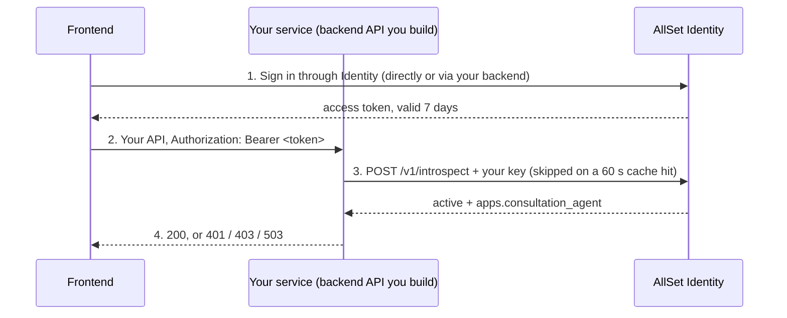

# Integrating a backend service with AllSet Identity

Your backend never stores passwords or verifies tokens itself. It forwards each
caller's bearer token to AllSet Identity's `POST /v1/introspect`. That call
returns who the user is and what they may do. Your service then allows the
request or answers 401, 403 or 503.

This guide is written for **Consultation Agent**, a backend API. It has its own
capability block, `apps.consultation_agent`, granted to exactly the Broker Tools
roles: anyone who can use Broker Tools can use Consultation Agent. It is a
separate block so the two can diverge later without a change in its code.

## Overview

AllSet Identity is a FastAPI service on Cloud Run (`asia-south1`). It is the
single sign-in for AllSet CMS, Broker Tools and WhatsApp Automation, backed by
Supabase Auth. A person signs in once, and the same access token works across
every AllSet app. Their roles travel inside that token.



Step 1 goes straight to Identity or through your backend; see
[Signing users in](#signing-users-in). Steps 2 to 4 are what you build.

| Responsibility | Owned by |
| --- | --- |
| Sign-in, passwords, sessions, token signing | Identity |
| Roles and what each role grants | Identity (`app/capabilities.py`) |
| Creating users, changing roles, deactivating | Identity admins (CLI or CMS Users & Roles) |
| Reading the `Authorization` header and calling introspect | Your service |
| Caching introspect results for 60 seconds | Your service |
| Mapping results to 401 / 403 / 503 | Your service |
| Applying lead-ownership rules to your own data | Your service |

The frontend that calls your API must send the user's Identity access token as
`Authorization: Bearer <token>`. That token comes from signing in through
Identity.

## Before you start: access you receive

You need three things from the Identity owner: the service URL, your own service
key, and test accounts. You need no Supabase credentials, no GCP access to the
Identity project and no admin role.

| You receive | Per environment | How it reaches you |
| --- | --- | --- |
| `IDENTITY_SERVICE_URL` | Yes, dev and prod differ | Message; it is not a secret |
| Your service key | Yes, a different key per environment | A Secret Manager secret in your service's GCP project, readable by your Cloud Run runtime service account |
| Test accounts in dev | Dev only | Email plus a password handed over privately |

Known URL: `https://allset-identity-gefxdgwgyq-el.a.run.app`, taken from
WhatsApp Automation's config. Confirm with the Identity owner which environment
it is, and get the prod URL.

Your key is yours alone. It unlocks only `/v1/introspect` and
`/v1/introspect/health`, and it can be revoked without touching any other
service. Never paste it in chat, email, a ticket or a commit.

**Do not ask for, and do not accept:**

- `SUPABASE_SERVICE_ROLE_KEY` or `SUPABASE_ANON_KEY`. The service-role key can
  act as any user and reads every lead in the shared project.
- The shared `ALLSET_SERVICE_KEY`. It also unlocks ai_service and the CMS
  backend's internal endpoints. If your config holds it today under another
  name, swap it for your own key when that arrives.
- An `admin` or `tech` role just to test. Use the dev test accounts.

### What the Identity owner does

- [ ] Deploy Identity with the `consultation_agent` capability block to each
      environment. Until then every sign-in to your service fails with "no access"
- [ ] Generate one key per environment:
      `python -c "import secrets; print(secrets.token_urlsafe(32))"`
- [ ] Add `consultation_agent:<key>` to `ALLSET_SERVICE_KEYS` in `.env.dev`, and later `.env.prod`
- [ ] Run `./scripts/setup_gcp_secrets.sh dev`, then `./deploy.sh dev` from a committed tree
- [ ] Store the same key as a secret in your service's GCP project; grant your
      runtime service account `roles/secretmanager.secretAccessor` on it
- [ ] If your browser calls Identity directly, add your frontend's origin to
      Identity's `CORS_ORIGINS` and redeploy (see Signing users in)
- [ ] Create dev test accounts (see Testing) with `scripts/manage_users.py`
- [ ] Send you the URL for each environment

CORS matters only if your frontend calls Identity straight from the browser;
server-to-server calls are not subject to it. Identity's Cloud Run service is
public (`--allow-unauthenticated`), so no IAM invoker grant is needed either way.

## Configuration

Your service needs four environment variables. The first two are required, and
your service must refuse to authenticate anyone when either is missing.

| Variable | Required | Default | Notes |
| --- | --- | --- | --- |
| `IDENTITY_SERVICE_URL` | Yes | none | Origin only, e.g. `https://allset-identity-….run.app`. No trailing slash, no `/v1`. |
| `IDENTITY_SERVICE_KEY` | Yes | none | Your own key. Bind it from Secret Manager, never from a plain env file in the repo. |
| `IDENTITY_TIMEOUT_SECONDS` | No | `2` | Introspect does no I/O and answers in milliseconds; 2 s matches CMS and Broker Tools. |
| `IDENTITY_CACHE_TTL` | No | `60` | Seconds to cache an introspect result. Lower means revocations bite sooner but more calls. |

Use the name `IDENTITY_SERVICE_KEY`, not `ALLSET_SERVICE_KEY`. Other repos use
`ALLSET_SERVICE_KEY` for the shared key, and reusing the name invites someone to
paste the wrong value.

On Cloud Run, bind the key with
`--set-secrets=IDENTITY_SERVICE_KEY=<secret-name>:latest`.

For local development, point `IDENTITY_SERVICE_URL` at the dev Identity URL with
your dev key. Running Identity locally needs Supabase credentials you will not
have.

## The introspect contract

Introspect always answers HTTP 200 for any token, good or bad. A non-200 means
Identity or your key is broken, never that the user is. Keep those two apart:
confusing them either locks everyone out during a blip or lets anyone in.

### Request

```http
POST {IDENTITY_SERVICE_URL}/v1/introspect
X-Allset-Service-Key: <IDENTITY_SERVICE_KEY>
Content-Type: application/json

{"token": "<the user's access token, without the 'Bearer ' prefix>"}
```

### Response for a valid token

```json
{
  "active": true,
  "user_id": "6f1c2a9e-0b7d-4c3e-9a51-2d8e7f4b1c06",
  "email": "someone@allset.in",
  "full_name": "Some One",
  "roles": ["presales", "viewer"],
  "role_labels": ["Pre-sales", "Viewer"],
  "is_active": true,
  "apps": {
    "cms": {
      "access": true,
      "primary_role": "viewer",
      "can_add_property": false,
      "can_edit_property": false,
      "can_publish": false,
      "can_upload_media": false,
      "can_edit_seo": false,
      "can_delete_property": false,
      "can_manage_users": false
    },
    "broker_tools": {
      "access": true,
      "primary_role": "presales",
      "unrestricted_leads": false,
      "own_presales": true,
      "own_sales": false
    },
    "consultation_agent": {
      "access": true,
      "primary_role": "presales"
    }
  }
}
```

`user_id` is the stable Supabase UUID. Key your own records on it rather than on
email.

### Response for an invalid, expired or deactivated token

```json
{"active": false, "reason": "Signature has expired.", "roles": [], "apps": {"cms": {"access": false, "…": "…"}, "broker_tools": {"access": false, "…": "…"}, "consultation_agent": {"access": false, "primary_role": null}}}
```

`reason` is for your logs only. Do not branch on it or show it to users; its
wording is not part of the contract. A deactivated user's response may also
carry `user_id` and `email`, so check `active` first, always.

### What each outcome means for your service

| Identity returns | Meaning | Your service answers |
| --- | --- | --- |
| 200, `active: true`, `apps.consultation_agent.access: true` | Allowed | Handle the request |
| 200, `active: true`, `apps.consultation_agent.access: false` | Signed in, but no Broker Tools role (e.g. a CMS-only `editor`) | **403** |
| 200, `active: false` | Token invalid, expired, or account deactivated | **401** |
| 401 | Your service key is wrong or missing: a deploy problem, not the user's | **503**, and log an error |
| Any other status, timeout, connection error, bad JSON | Identity is down or broken | **503**. Never let the request through |

No `Authorization` header, or not `Bearer <token>`: answer 401 yourself without
calling Identity.

### Health check

`GET {IDENTITY_SERVICE_URL}/v1/introspect/health` with your key header returns
`{"status": "ok"}` and 200, or 401 if the key is wrong. Call it at startup or in
a deploy smoke test to catch a bad key before users do.

Use the `/v1/...` paths. The same routes also answer under `/identity/v1/...`
for browsers going through Firebase Hosting; backends do not need that prefix.

## Implementation

One module talks to Identity, and one dependency guards every route. The
reference below is Python (FastAPI with httpx), like the other AllSet services.
It was run against the real Identity app for all eight outcomes in the contract
table. On another stack, port the same behaviour.

1. Add the four environment variables from Configuration.
2. Copy `identity_client.py` below into your service.
3. Put `Depends(current_user)` on every route that needs a signed-in user.
4. Apply the Broker Tools lead flags to your own queries (see Authorisation).
5. Call the health endpoint in your deploy smoke test.

### identity_client.py

```python
"""AllSet Identity client: the one place this service talks to Identity."""

from __future__ import annotations

import hashlib
import logging
import os
import time

import httpx
from fastapi import Header, HTTPException

log = logging.getLogger(__name__)

IDENTITY_SERVICE_URL = os.environ.get("IDENTITY_SERVICE_URL", "").rstrip("/")
IDENTITY_SERVICE_KEY = os.environ.get("IDENTITY_SERVICE_KEY", "")
IDENTITY_TIMEOUT_SECONDS = float(os.environ.get("IDENTITY_TIMEOUT_SECONDS", "2"))
IDENTITY_CACHE_TTL = int(os.environ.get("IDENTITY_CACHE_TTL", "60"))
_CACHE_MAX_ENTRIES = 1024

_client = httpx.AsyncClient(timeout=IDENTITY_TIMEOUT_SECONDS)
_cache: dict[str, tuple[dict, float]] = {}  # sha256(token) -> (payload, expires_at)


class IdentityUnavailable(Exception):
    """Identity could not give an answer. Callers must fail closed (503)."""


async def introspect(token: str) -> dict:
    # The token is a credential: hash it rather than using it as a cache key.
    key = hashlib.sha256(token.encode()).hexdigest()
    hit = _cache.get(key)
    if hit and hit[1] > time.monotonic():
        return hit[0]

    if not IDENTITY_SERVICE_URL or not IDENTITY_SERVICE_KEY:
        raise IdentityUnavailable("identity is not configured")
    try:
        resp = await _client.post(
            f"{IDENTITY_SERVICE_URL}/v1/introspect",
            json={"token": token},
            headers={"X-Allset-Service-Key": IDENTITY_SERVICE_KEY},
        )
    except httpx.HTTPError as exc:
        raise IdentityUnavailable("identity unreachable") from exc
    if resp.status_code == 401:
        log.error("identity rejected our service key")  # a deploy problem, not the user's
        raise IdentityUnavailable("service key rejected")
    if resp.status_code != 200:
        raise IdentityUnavailable(f"identity returned {resp.status_code}")
    try:
        payload = resp.json()
    except ValueError as exc:
        raise IdentityUnavailable("identity returned invalid JSON") from exc

    if len(_cache) >= _CACHE_MAX_ENTRIES:
        _cache.clear()
    _cache[key] = (payload, time.monotonic() + IDENTITY_CACHE_TTL)
    return payload


async def current_user(authorization: str | None = Header(default=None)) -> dict:
    """FastAPI dependency: the introspect payload of a caller allowed in."""
    scheme, _, token = (authorization or "").partition(" ")
    if scheme.lower() != "bearer" or not token.strip():
        raise HTTPException(401, "Missing or invalid Authorization header.",
                            headers={"WWW-Authenticate": "Bearer"})
    try:
        payload = await introspect(token.strip())
    except IdentityUnavailable:
        log.exception("identity unavailable; failing closed")
        raise HTTPException(503, "Authentication service unavailable.") from None
    if not payload.get("active"):
        raise HTTPException(401, "Invalid or expired token.",
                            headers={"WWW-Authenticate": "Bearer"})
    if not payload.get("apps", {}).get("consultation_agent", {}).get("access"):
        raise HTTPException(403, "Your account does not have access to this service.")
    return payload
```

### Using it on a route

```python
from fastapi import APIRouter, Depends

from .identity_client import current_user

router = APIRouter()


@router.get("/things")
async def list_things(user: dict = Depends(current_user)):
    bt = user["apps"]["broker_tools"]
    ...  # lead scope from bt, see Authorisation
```

### Why it is built this way

- **The 60 s cache** keeps most requests from leaving your process. It is per
  process, which is fine; use Redis instead if you already run it.
- **The cache key is a SHA-256 of the token**, never the token itself, so a
  cache dump leaks no credentials.
- **Every failure to get an answer becomes 503**, never 401 and never a pass. A
  401 would bounce users to a sign-in that cannot fix an outage.
- **The 403 check is on `apps.consultation_agent.access`**, not on role names,
  so a later change to who may use your service needs no code change here.

## Authorisation

Decide who gets in from `apps.consultation_agent.access`, and which leads they
see from the `apps.broker_tools` flags. Never decide from role names. Both are
computed in one place, [`app/capabilities.py`](../app/capabilities.py), so every
app reaches the same verdict for the same person.

### Who gets in

| Role | Label | In your service | Flag that is true |
| --- | --- | --- | --- |
| `admin` | Admin | All leads | `unrestricted_leads` |
| `tech` | Tech | All leads | `unrestricted_leads` |
| `lead_manager` | Lead Manager | All leads | `unrestricted_leads` |
| `presales` | Pre-sales | Own leads, by presales owner | `own_presales` |
| `sales` | Sales | Own leads, by sales owner | `own_sales` |
| `manager`, `editor`, `viewer` | CMS roles | No access, 403 | none; `access` is false |

A user holds a set of roles, and their capabilities are the union.
`{sales, viewer}` gets own sales leads here plus read-only CMS. Identity
guarantees nobody holds both `presales` and `sales`.

### The `consultation_agent` block

| Field | Type | Use it for |
| --- | --- | --- |
| `access` | bool | Whether to let them in at all. `current_user` already checks it. |
| `primary_role` | string or null | Display and audit columns only, never access. Precedence: admin, tech, lead_manager, presales, sales. |

### Lead scope: the `broker_tools` flags

If your service shows leads, scope them with these flags from the same
response. They describe the same person under the rules Broker Tools applies.

| Field | Type | Use it for |
| --- | --- | --- |
| `unrestricted_leads` | bool | Check first. True means no ownership filter. |
| `own_presales` | bool | Only matters when `unrestricted_leads` is false. Filter by presales owner. |
| `own_sales` | bool | Only matters when `unrestricted_leads` is false. Filter by sales owner. |

### Applying it to lead data

1. `unrestricted_leads` is true: return everything.
2. `own_presales` is true: return leads where `fk_presales_owner` is this person.
3. `own_sales` is true: return leads where `fk_sales_owner` is this person.
4. None of these: return nothing. Do not fall back to all leads.

The owner columns point at `team_members.id` in the call_logs database, which
Identity does not know. WhatsApp Automation looks up the `team_members` row by
the introspected email. If no row matches, show nothing.

If you need a distinction the flags do not express, such as "only lead managers
may export", ask the Identity owner to add a capability. Do not start reading
`roles` yourself; that is how the old apps' permission rules drifted apart.

`GET {IDENTITY_SERVICE_URL}/v1/auth/roles` needs no auth and returns the full
role vocabulary with each role's capabilities, if you want a reference in your
UI.

## Signing users in

Which path Consultation Agent's sign-in takes is not settled yet. Both work.
Pick one and tell the Identity owner, because the browser path may need a change
on their side.

| | Your backend proxies sign-in | Your browser calls Identity |
| --- | --- | --- |
| Who calls `/v1/auth/login` | Your backend | Your frontend |
| URL | `{IDENTITY_SERVICE_URL}/v1/auth/login` | `/identity/v1/auth/login` on the same Firebase Hosting site, or Identity's own URL |
| Change on Identity's side | None | Add your frontend's origin to `CORS_ORIGINS` and redeploy, unless it is served from the same Firebase Hosting site, which already routes `/identity/**` to Identity |
| Same pattern as | WhatsApp Automation | CMS admin panel, Broker Tools web |

No service key is needed on these endpoints. Tokens travel in the
`Authorization` header; Identity uses no cookies.

### `POST /v1/auth/login`

Request body: `{"email": "...", "password": "..."}`. The response carries the
tokens plus the same `user` object introspect returns, so you can decide access
without a second call:

```json
{
  "access_token": "<JWT>",
  "refresh_token": "<opaque>",
  "token_type": "bearer",
  "expires_in": 604800,
  "user": {"active": true, "user_id": "…", "roles": ["presales"], "apps": {"consultation_agent": {"access": true, "…": "…"}, "…": "…"}}
}
```

A 200 only proves the password. Check `user.apps.consultation_agent.access`
before treating it as a successful sign-in, and show "no access" when it is
false.

| Identity returns | Meaning | Your service answers |
| --- | --- | --- |
| 200, `consultation_agent.access: false` | Right password, no Broker Tools role | 403, "no access" |
| 401 | Wrong email or password; one message for every case, by design | 401, "Invalid email or password" |
| 403 | Account deactivated | 403 |
| 422 | Malformed email or empty password | 401, same generic message |
| 429 | Over 10 attempts per email per minute, a budget shared by every AllSet app | 429, "try again shortly" |
| 5xx, timeout | Identity is broken | 503 |

### Refresh and logout

- `POST /v1/auth/refresh` with `{"refresh_token": "..."}` returns the same shape
  as login. 401 means the refresh token is invalid or revoked; 403 means the
  account was deactivated.
- `POST /v1/auth/logout` with `Authorization: Bearer <token>` returns 204. It
  ends the session, but the access token keeps passing introspect until it
  expires, so also drop it from your cache.

If your backend proxies sign-in, never log the request body or the tokens in the
response.

## Gotchas

The biggest surprise is that removing someone's access is not immediate. Access
tokens live for 7 days, and an issued token cannot be recalled.

- **Revocation lag of up to 7 days plus your cache TTL.** Roles and active
  status are stamped into the token when it is issued. A role change or
  deactivation stops new tokens, but a token already in a browser keeps its old
  roles until it expires. If your service exposes something that must be cut
  off at once, raise it with the Identity owner before launch.
- **Do not decode or verify the JWT yourself**, even though the claims are
  readable. Their layout is internal to Identity and the capability rules live
  there. Introspect is the contract.
- **Never log the `Authorization` header, the token or your service key.** Log
  `user_id` when you need to trace a user.
- **An expired token gets a 401 from you.** The user then signs in again, or
  your client refreshes if it holds a refresh token.
- **The token goes in the JSON body to Identity**, not in a header. An empty
  `token` gets a 422 from Identity, which `current_user` avoids by rejecting it
  first.
- **Introspect is not rate limited, but cache anyway.** It does no database or
  Supabase call, so it is fast, yet 60 s of caching removes most network hops.

## Testing and go-live

Test every row of the contract table twice: once in unit tests with Identity
stubbed, once in dev against the real Identity.

### Unit tests

Stub Identity at the HTTP boundary (`respx` for httpx), the way CMS, Broker
Tools and WhatsApp Automation do. Cover each outcome:

- `active: true` with `consultation_agent.access: true` returns 200
- `active: true` with `consultation_agent.access: false` returns 403
- `active: false` returns 401
- No or malformed `Authorization` header returns 401 without calling Identity
- Identity answers 401 (bad key) returns 503
- Identity answers 500, times out or is unreachable returns 503
- A second request with the same token inside 60 s makes no Identity call
- If your backend proxies sign-in: each row of the login table above

### Dev test accounts

Ask the Identity owner to create these in dev:

| Account | Roles | Expected in your service |
| --- | --- | --- |
| Lead manager test | `lead_manager` | 200, all leads |
| Pre-sales test | `presales` | 200, only leads where they are presales owner |
| Sales test | `sales` | 200, only leads where they are sales owner |
| CMS-only test | `viewer` | 403 |

A deactivated account cannot sign in to get a fresh token. Test the 401 path
with an expired or garbage token instead.

### Manual checks against dev

Check your key:

```bash
curl -i "$IDENTITY_SERVICE_URL/v1/introspect/health" -H "X-Allset-Service-Key: $IDENTITY_SERVICE_KEY"
```

Get a token for a test account and copy `access_token` from the response.
Sign-in allows 10 attempts per email per minute.

```bash
curl -s -X POST "$IDENTITY_SERVICE_URL/v1/auth/login" -H "Content-Type: application/json" -d '{"email": "<test account>", "password": "<password>"}'
```

Call your own service with it:

```bash
curl -i "$YOUR_SERVICE_URL/things" -H "Authorization: Bearer $TOKEN"
```

### Go-live checklist

- [ ] Identity with the `consultation_agent` block is deployed to prod
- [ ] Prod key created by the Identity owner and bound from Secret Manager as
      `IDENTITY_SERVICE_KEY`; the shared key is gone from your config
- [ ] `IDENTITY_SERVICE_URL` points at prod Identity
- [ ] If your browser calls Identity directly, your prod origin is in Identity's `CORS_ORIGINS`
- [ ] Health check returns 200 with the prod key, in the deploy smoke test
- [ ] Each dev test account gets the expected result
- [ ] With `IDENTITY_SERVICE_URL` pointed at a dead host in dev, your service answers 503, not 200 or 401
- [ ] No token, `Authorization` header, password or key appears in your logs
- [ ] Real users of your service hold a Broker Tools role in prod (Identity owner)
